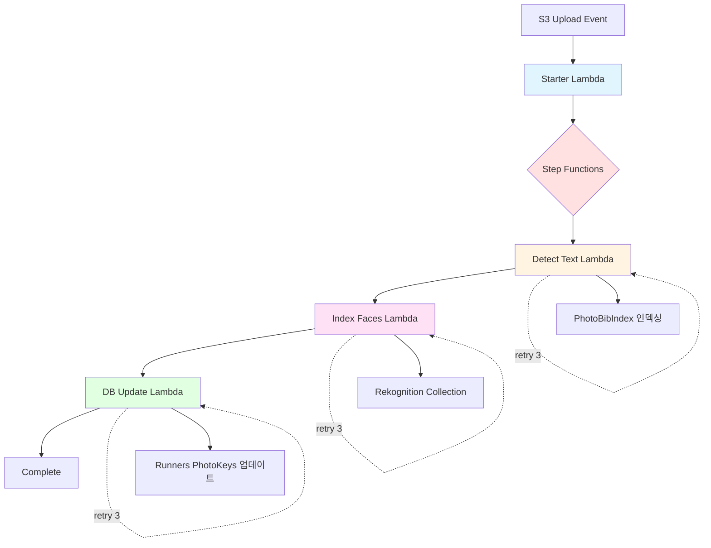

# 📸 Photo Processing Stack 구현 계획서

> **작성일**: 2025-11-05  
> **최종 업데이트**: 2025-11-05  
> **상태**: ✅ 설계 확정, 구현 준비 완료  
> **목표**: 복원력과 유연성을 갖춘 러닝 대회 사진 검색 시스템 재설계 및 구현

---

## 📋 목차

1. [개요](#1-개요)
2. [최종 결정 사항](#2-최종-결정-사항)
3. [채택된 설계 원칙](#3-채택된-설계-원칙)
4. [데이터 모델](#4-데이터-모델)
5. [Lambda 함수 구현 계획](#5-lambda-함수-구현-계획)
6. [Step Functions 워크플로우](#6-step-functions-워크플로우)
7. [검색 API 설계](#7-검색-api-설계)
8. [구현 우선순위 및 일정](#8-구현-우선순위-및-일정)
9. [모니터링 및 운영](#9-모니터링-및-운영)
10. [부록](#10-부록)

---

## 1. 개요

### 1.1 목표

- ✅ **복원력**: Step Functions를 활용한 안정적인 워크플로우 관리
- ✅ **검색 최적화**: Bib 검색 인덱스와 사진 메타데이터 분리
- ✅ **유연성**: Runners 테이블 선택적 활용
- ✅ **단순성**: Rekognition의 ExternalImageId를 활용한 얼굴 인덱스 관리

### 1.2 현재 구현 상태

#### ✅ 완료된 항목

- **인프라**:
  - S3 Bucket: `snaprace`
  - DynamoDB 테이블:
    - `EventPhotos`: 사진 메타데이터 저장 (키: EventKey, S3ObjectKey)
    - `PhotoBibIndex`: Bib Number 검색 인덱스
    - `RunnersV2`: 참가자 정보 및 사진첩 (선택적)
- **Lambda Common Layer** ✅:
  - 타입 정의 (`shared/types.ts`)
  - DynamoDB Helper (`shared/dynamodb-helper.ts`)
  - Rekognition Helper (`shared/rekognition-helper.ts`)
  - Bib Extractor (`shared/bib-extractor.ts`)
  - 환경 변수 Validator (`shared/env-validator.ts`)
  - CDK Layer 정의 완료 (번들링 설정 포함)
  - 공통 환경 변수 객체 정의 완료

- **Starter Lambda** ✅:
  - S3 Event 파싱 및 경로 추출
  - Idempotency 체크 (ProcessingStatus 확인)
  - EventPhotos 초기화 (PENDING 상태)
  - Step Functions 실행
  - 구조화된 로깅 (Lambda Powertools)
  - CDK Stack 통합 (권한 부여 포함)

- **Detect Text Lambda** ✅:
  - Rekognition DetectText API 호출
  - 5단계 Bib Number 필터링 (숫자, 신뢰도, 워터마크, 크기, 중복)
  - Runners 테이블 기반 Bib 검증 (선택적)
  - PhotoBibIndex 배치 인덱싱
  - EventPhotos 업데이트 (TEXT_DETECTED)
  - Idempotency 지원
  - CDK Stack 통합 (Rekognition 권한 포함)

#### 🚧 구현 예정 항목

- Lambda 함수 2개 (Index Faces, DB Update)
- Step Functions State Machine
- API Gateway (검색 API)
- S3 Event Notification (Starter Lambda 연결)
- Rekognition Collection (자동 생성)

### 1.3 기존 아키텍처와의 주요 차이점

#### 데이터 모델 변경

| 항목                | 기존                                      | 신규                                               | 변경 이유                       |
| ------------------- | ----------------------------------------- | -------------------------------------------------- | ------------------------------- |
| **Bib 인덱스**      | Photos 테이블에 bib_number 속성           | 별도 PhotoBibIndex 테이블                          | 복수 Bib 처리, 검색 최적화      |
| **얼굴 인덱스**     | PhotoFaces 테이블 관리                    | Rekognition ExternalImageId 활용                   | 중복 관리 제거, 단순화          |
| **사진 메타데이터** | Photos 테이블 (PK: eventId, SK: photoKey) | EventPhotos 테이블 (PK: EventKey, SK: S3ObjectKey) | 다중 조직자 지원, 명확한 네이밍 |
| **Runners 역할**    | Bib 검증 전용                             | Bib 검증 + 통합 사진첩                             | 기능 확장                       |
| **PhotoKeys 타입**  | N/A                                       | **StringSet** (중복 자동 제거)                     | 효율성, 간결성                  |

#### 워크플로우 변경

| 항목               | 기존                             | 신규                                |
| ------------------ | -------------------------------- | ----------------------------------- |
| **오케스트레이션** | SQS + Lambda 체인                | **Step Functions State Machine**    |
| **Bib 처리**       | 단일 Bib만 저장                  | 복수 Bib 모두 인덱싱                |
| **얼굴 검색 결과** | FaceId → DynamoDB 조회 → S3 경로 | FaceId → ExternalImageId = S3 경로  |
| **사진첩 조회**    | Photos 테이블 쿼리               | Runners 테이블의 PhotoKeys 속성조회 |
| **재시도 전략**    | Lambda 자체 재시도               | Step Functions 재시도 정책          |
| **가시성**         | CloudWatch Logs만                | Step Functions 콘솔 + CloudWatch    |

---

## 2. 최종 결정 사항

### 2.1 오케스트레이션

- **결정**: ✅ **Phase 1부터 Step Functions 사용**
- **이유**: 복원력, 가시성, 재시도 정책의 중요성
- **트레이드오프**: 초기 구현 복잡도 증가 수용

### 2.2 데이터 타입

- **결정**: ✅ **PhotoKeys를 StringSet으로 저장**
- **이유**: 자동 중복 제거, ADD 연산 지원
- **트레이드오프**: 순서 보장 안 됨 (클라이언트에서 정렬)

### 2.3 Rekognition Collection 생성

- **결정**: ✅ **Index Faces Lambda에서 자동 생성**
- **이유**: 이벤트 수 사전 예측 불가, 자동화 우선
- **최적화**: DescribeCollection 호출 결과 캐싱

### 2.4 워터마크 필터링

- **결정**: ✅ **3가지 필터링 조합**
  1. 영역 기반: 하단 35% 제외
  2. 크기 기반: 높이 < 50px 제외
  3. 신뢰도 기반: Confidence < 90% 제외

### 2.5 Bib Number 범위

- **결정**: ✅ **숫자만, 1 ~ 99999**
- **확장**: 환경 변수 `BIB_NUMBER_PATTERN`으로 패턴 설정 가능

---

## 3. 채택된 설계 원칙

### 3.1 아키텍처 원칙

#### ✅ Lambda Layer 활용

**현재 상태**: `lambda/common-layer/` 폴더 존재

**활용 계획**:

- `shared/dynamodb-helper.ts`: DynamoDB 공통 로직
- `shared/rekognition-helper.ts`: Rekognition 공통 로직
- `shared/types.ts`: 공통 타입 정의
- `shared/env-validator.ts`: 환경 변수 검증

**모든 Lambda에 Layer 첨부**

---

#### ✅ 멱등성 보장

**ProcessingStatus 활용**:

- `PENDING`: 초기 상태
- `TEXT_DETECTED`: Detect Text 완료
- `FACES_INDEXED`: Index Faces 완료
- `COMPLETED`: 전체 처리 완료

**각 Lambda 진입점에서 상태 확인**:

```typescript
// Detect Text Lambda
const photo = await getEventPhoto(organizer, eventId, objectKey);
if (photo.ProcessingStatus !== "PENDING") {
  console.log("Already processed TEXT_DETECTED, skipping");
  return;
}
```

**중복 S3 이벤트에도 안전**

---

#### ✅ 비용 최적화

**1. 조건부 IndexFaces**

```typescript
// DetectFaces로 사전 확인
const detectResult = await rekognition.detectFaces({
  Image: { S3Object: { Bucket: bucket, Name: objectKey } },
});

if (detectResult.FaceDetails.length === 0) {
  console.log("No faces detected, skipping IndexFaces");
  return { faceIds: [], faceCount: 0 };
}
```

**2. Lambda 메모리 최적화**

- Starter: 128MB (메타데이터만)
- Detect Text: 512MB (Rekognition 호출)
- Index Faces: 512MB (Rekognition 호출)
- DB Update: 128MB (DynamoDB만)

**3. DynamoDB On-Demand 모드**

- 트래픽 예측 어려움
- 이벤트별 burst 트래픽 대응

---

### 3.2 기능 원칙

#### ✅ 그룹 사진 처리

**채택**: EventPhotos에 `isGroupPhoto` 플래그 추가

```typescript
// DB Update Lambda
const isGroupPhoto = detectedBibs.length > 1 && faceIds.length > 1;

await dynamodb.updateItem({
  TableName: "EventPhotos",
  Key: { EventKey, S3ObjectKey },
  UpdateExpression: "SET isGroupPhoto = :flag",
  ExpressionAttributeValues: {
    ":flag": isGroupPhoto,
  },
});
```

**클라이언트 활용**:

- 개인 사진: 기본 표시
- 그룹 사진: "함께 찍힌 사진" 섹션으로 분리

---

#### ✅ Selfie 검색 결과 Runners 반영

**채택**: 검색 API에서 실시간 업데이트

```typescript
async function searchBySelfieAndUpdateRunners(organizer: string, eventId: string, selfieImageBytes: Buffer) {
  // 1. Selfie로 사진 찾기
  const photoKeys = await searchBySelfie(organizer, eventId, selfieImageBytes);

  // 2. 각 사진의 Bib 조회 (EventPhotos.DetectedBibs)
  const bibsToUpdate = new Set<string>();
  for (const photoKey of photoKeys) {
    const photo = await getEventPhoto(organizer, eventId, photoKey);
    photo.DetectedBibs?.forEach((bib) => bibsToUpdate.add(bib));
  }

  // 3. Runners.PhotoKeys 업데이트
  for (const bib of bibsToUpdate) {
    await dynamodb.updateItem({
      TableName: "RunnersV2",
      Key: {
        pk: `ORG#${organizer}#EVT#${eventId}`,
        sk: `BIB#${bib}`,
      },
      UpdateExpression: "ADD PhotoKeys :keys",
      ExpressionAttributeValues: {
        ":keys": dynamodb.createSet(photoKeys),
      },
    });
  }

  return photoKeys;
}
```

---

#### ✅ 재처리 메커니즘

**채택**: 점진적 업데이트 (옵션 2)

**동작 방식**:

- Selfie 검색 시마다 새로 찾은 사진을 Runners.PhotoKeys에 추가
- 시간이 지날수록 사진첩 완성도 향상
- 배치 재처리 불필요

---

### 3.3 운영 원칙

#### ✅ 모니터링

**CloudWatch Metrics**:

- Lambda 실행 시간 (Duration)
- Lambda 에러율 (Errors / Invocations)
- Rekognition API 호출 수 (Custom Metric)
- DynamoDB 읽기/쓰기 용량 (ConsumedReadCapacityUnits, ConsumedWriteCapacityUnits)
- Step Functions 실행 상태 (ExecutionsFailed, ExecutionsSucceeded)

**CloudWatch Alarms**:

- Lambda 에러율 > 5% (SNS 알림)
- Rekognition API 제한 도달 (ThrottlingException)
- DynamoDB 스로틀링 (ProvisionedThroughputExceededException)
- Step Functions 실패율 > 10%

---

#### ✅ 로깅 전략

**구조화된 로깅**:

```typescript
import { Logger } from "@aws-lambda-powertools/logger";

const logger = new Logger({ serviceName: "photo-processing" });

logger.info("Processing photo", {
  organizer,
  eventId,
  objectKey,
  stage: "detect-text",
  detectedBibs,
  duration: Date.now() - startTime,
});
```

**로그 레벨**:

- ERROR: Lambda 실패, Rekognition 에러
- WARN: Runners 테이블 없음, Bib 미감지
- INFO: 정상 처리, 단계 완료
- DEBUG: 상세 디버깅 정보 (dev 환경만)

---

#### ⏭️ 테스트 (추후 적용)

**단위 테스트**: Jest + aws-sdk-mock  
**통합 테스트**: LocalStack  
**부하 테스트**: Artillery (동시 업로드 1000장)

---

## 4. 데이터 모델

### 4.1 EventPhotos 테이블

**목적**: 사진의 원본 메타데이터 저장 (단일 레코드 원칙)

| 속성                 | 타입         | 설명                            | 예시                                           |
| -------------------- | ------------ | ------------------------------- | ---------------------------------------------- |
| **EventKey** (PK)    | String       | `ORG#{organizer}#EVT#{eventId}` | `ORG#snaprace#EVT#seoul2024`                   |
| **S3ObjectKey** (SK) | String       | S3 객체 경로                    | `snaprace/org1/event1/photos/raw/photo123.jpg` |
| UploadTimestamp      | Number       | 업로드 시간 (Unix timestamp)    | `1699200000`                                   |
| ImageWidth           | Number       | 이미지 가로 크기                | `4032`                                         |
| ImageHeight          | Number       | 이미지 세로 크기                | `3024`                                         |
| RekognitionImageId   | String       | Rekognition 이미지 ID           | `uuid-v4`                                      |
| ProcessingStatus     | String       | 처리 상태                       | `PENDING`, `TEXT_DETECTED`, `FACES_INDEXED`    |
| DetectedBibs         | List<String> | 감지된 Bib Number 목록          | `["100", "101"]`                               |
| FaceIds              | List<String> | 감지된 얼굴 ID 목록             | `["face-uuid-1", "face-uuid-2"]`               |
| **isGroupPhoto**     | Boolean      | 그룹 사진 여부                  | `true` / `false`                               |

### 4.2 PhotoBibIndex 테이블

**목적**: Bib Number 기반 역 인덱스 (복수 Bib 처리)

| 속성                 | 타입   | 설명                                            | 예시                                           |
| -------------------- | ------ | ----------------------------------------------- | ---------------------------------------------- |
| **EventBibKey** (PK) | String | `ORG#{organizer}#EVT#{eventId}#BIB#{bibNumber}` | `ORG#snaprace#EVT#seoul2024#BIB#100`           |
| **S3ObjectKey** (SK) | String | S3 객체 경로                                    | `snaprace/org1/event1/photos/raw/photo123.jpg` |
| IndexedAt            | Number | 인덱싱 시간 (Unix timestamp)                    | `1699200000`                                   |

**특징**:

- 사진 1장에 Bib 2개가 감지되면 → 레코드 2개 생성
- 복수 참가자가 함께 찍힌 그룹 사진 처리 가능

### 4.3 RunnersV2 테이블 (선택적)

**목적**: 참가자 정보 + 통합 사진첩

| 속성            | 타입      | 설명                                 | 예시                                         |
| --------------- | --------- | ------------------------------------ | -------------------------------------------- |
| **pk** (PK)     | String    | `ORG#{organizer}#EVT#{eventId}`      | `ORG#snaprace#EVT#seoul2024`                 |
| **sk** (SK)     | String    | `BIB#{bibNumber}`                    | `BIB#100`                                    |
| name            | String    | 참가자 이름                          | `홍길동`                                     |
| finish_time_sec | Number    | 완주 시간 (초)                       | `3600`                                       |
| **PhotoKeys**   | StringSet | 통합 사진첩 (Bib + Selfie 검색 결과) | `{"photo1.jpg", "photo2.jpg"}` (Set, 중복 X) |

**PhotoKeys StringSet의 장점**:

- DynamoDB `ADD` 연산으로 중복 자동 제거
- 원자적 업데이트 (동시성 문제 없음)
- 클라이언트에서 정렬 가능 (UploadTimestamp 기준 등)

---

## 5. Lambda 함수 구현 계획

### 5.1 Starter Lambda (Step Functions 진입점)

**파일**: `lambda/photo-process/starter-lambda/index.ts`

#### 역할

- S3 `OBJECT_CREATED` 이벤트 수신
- 기본 메타데이터 추출 및 검증
- **Step Functions 실행 시작**

#### 입력

```json
{
  "Records": [
    {
      "s3": {
        "bucket": { "name": "snaprace" },
        "object": { "key": "org1/event1/photos/raw/photo123.jpg" }
      }
    }
  ]
}
```

#### 출력 (Step Functions Input)

```json
{
  "bucket": "snaprace",
  "objectKey": "org1/event1/photos/raw/photo123.jpg",
  "organizer": "org1",
  "eventId": "event1",
  "uploadTimestamp": 1699200000
}
```

#### 주요 로직

```typescript
export const handler = async (event: S3Event) => {
  for (const record of event.Records) {
    const bucket = record.s3.bucket.name;
    const objectKey = decodeURIComponent(record.s3.object.key.replace(/\+/g, " "));

    // 1. S3 경로 파싱: {org}/{event}/photos/raw/{filename}
    const pathMatch = objectKey.match(/^([^/]+)\/([^/]+)\/photos\/raw\/(.+)$/);
    if (!pathMatch) {
      logger.warn("Invalid S3 path format", { objectKey });
      continue;
    }

    const [, organizer, eventId, filename] = pathMatch;

    // 2. 멱등성 체크
    const existingPhoto = await getEventPhoto(organizer, eventId, objectKey);
    if (existingPhoto && existingPhoto.ProcessingStatus !== "PENDING") {
      logger.info("Photo already processed", { objectKey, status: existingPhoto.ProcessingStatus });
      continue;
    }

    // 3. EventPhotos 초기 레코드 생성
    await dynamodb.putItem({
      TableName: process.env.EVENT_PHOTOS_TABLE!,
      Item: {
        EventKey: `ORG#${organizer}#EVT#${eventId}`,
        S3ObjectKey: objectKey,
        UploadTimestamp: Date.now(),
        ProcessingStatus: "PENDING",
      },
      ConditionExpression: "attribute_not_exists(S3ObjectKey)",
    });

    // 4. Step Functions 실행
    await stepFunctions.startExecution({
      stateMachineArn: process.env.STATE_MACHINE_ARN!,
      input: JSON.stringify({
        bucket,
        objectKey,
        organizer,
        eventId,
        uploadTimestamp: Date.now(),
      }),
    });

    logger.info("Started Step Functions execution", { objectKey });
  }
};
```

---

### 5.2 Detect Text Lambda

**파일**: `lambda/photo-process/detect-text/index.ts`

#### 역할

- Rekognition DetectText API 호출
- Bib Number 추출 및 필터링 (3단계)
- PhotoBibIndex 테이블에 인덱싱

#### 입력 (Step Functions에서 전달)

```json
{
  "bucket": "snaprace",
  "objectKey": "org1/event1/photos/raw/photo123.jpg",
  "organizer": "org1",
  "eventId": "event1"
}
```

#### 출력

```json
{
  "detectedBibs": ["100", "101"],
  "bibCount": 2
}
```

#### 주요 로직

```typescript
export const handler = async (input: StepFunctionInput) => {
  const { bucket, objectKey, organizer, eventId } = input;

  // 1. Rekognition DetectText 호출
  const detectResult = await rekognition.detectText({
    Image: { S3Object: { Bucket: bucket, Name: objectKey } },
  });

  // 2. Bib Number 추출 (3단계 필터링)
  const detectedBibs = extractAndFilterBibs(detectResult.TextDetections, {
    imageWidth: input.imageWidth,
    imageHeight: input.imageHeight,
  });

  // 3. (선택적) Runners 테이블로 검증
  const validBibs = await validateBibsWithRunners(organizer, eventId, detectedBibs);

  // 4. PhotoBibIndex 테이블 인덱싱 (배치)
  const batchWrites = validBibs.map((bib) => ({
    PutRequest: {
      Item: {
        EventBibKey: `ORG#${organizer}#EVT#${eventId}#BIB#${bib}`,
        S3ObjectKey: objectKey,
        IndexedAt: Date.now(),
      },
    },
  }));

  await dynamodb.batchWriteItem({
    RequestItems: {
      [process.env.PHOTO_BIB_INDEX_TABLE!]: batchWrites,
    },
  });

  // 5. EventPhotos 테이블 업데이트
  await dynamodb.updateItem({
    TableName: process.env.EVENT_PHOTOS_TABLE!,
    Key: {
      EventKey: `ORG#${organizer}#EVT#${eventId}`,
      S3ObjectKey: objectKey,
    },
    UpdateExpression: "SET DetectedBibs = :bibs, ProcessingStatus = :status",
    ExpressionAttributeValues: {
      ":bibs": validBibs,
      ":status": "TEXT_DETECTED",
    },
  });

  return { detectedBibs: validBibs, bibCount: validBibs.length };
};

// 3단계 필터링
function extractAndFilterBibs(textDetections: TextDetection[], imageInfo: ImageInfo): string[] {
  const bibs = new Set<string>();

  for (const detection of textDetections) {
    if (detection.Type !== "LINE") continue;

    const text = detection.DetectedText;
    const confidence = detection.Confidence || 0;
    const geometry = detection.Geometry?.BoundingBox;

    // 필터 1: 숫자만, 1-99999 범위
    if (!/^\d+$/.test(text)) continue;
    const bibNumber = parseInt(text, 10);
    if (bibNumber < 1 || bibNumber > 99999) continue;

    // 필터 2: 워터마크 영역 제외 (하단 35%)
    if (isWatermarkArea(geometry, imageInfo)) continue;

    // 필터 3: 크기 기반 (높이 < 50px 제외)
    const textHeight = (geometry?.Height || 0) * imageInfo.imageHeight;
    if (textHeight < 50) continue;

    // 필터 4: 신뢰도 기반 (< 90% 제외)
    if (confidence < 90) continue;

    bibs.add(text);
  }

  return Array.from(bibs);
}
```

---

### 5.3 Index Faces Lambda

**파일**: `lambda/photo-process/index-faces/index.ts`

#### 역할

- Rekognition Collection 확인/자동 생성
- IndexFaces API 호출 (ExternalImageId = S3ObjectKey)
- EventPhotos 테이블 업데이트

#### 입력

```json
{
  "bucket": "snaprace",
  "objectKey": "org1/event1/photos/raw/photo123.jpg",
  "organizer": "org1",
  "eventId": "event1",
  "detectedBibs": ["100", "101"]
}
```

#### 출력

```json
{
  "faceIds": ["face-uuid-1", "face-uuid-2"],
  "faceCount": 2
}
```

#### 주요 로직

```typescript
export const handler = async (input: StepFunctionInput) => {
  const { bucket, objectKey, organizer, eventId, detectedBibs } = input;

  // 1. 조건부 IndexFaces (얼굴 없으면 스킵)
  const detectResult = await rekognition.detectFaces({
    Image: { S3Object: { Bucket: bucket, Name: objectKey } },
  });

  if (detectResult.FaceDetails.length === 0) {
    logger.info("No faces detected, skipping IndexFaces", { objectKey });
    return { faceIds: [], faceCount: 0 };
  }

  // 2. Rekognition Collection 확인/생성
  const collectionId = `${organizer}-${eventId}`;
  await ensureCollectionExists(collectionId);

  // 3. IndexFaces 호출 (ExternalImageId = S3ObjectKey)
  const indexResult = await rekognition.indexFaces({
    CollectionId: collectionId,
    Image: { S3Object: { Bucket: bucket, Name: objectKey } },
    ExternalImageId: objectKey, // ← 핵심
    DetectionAttributes: ["ALL"],
    MaxFaces: 10,
    QualityFilter: "AUTO",
  });

  const faceIds = indexResult.FaceRecords.map((record) => record.Face.FaceId);

  // 4. EventPhotos 테이블 업데이트
  const isGroupPhoto = detectedBibs.length > 1 && faceIds.length > 1;

  await dynamodb.updateItem({
    TableName: process.env.EVENT_PHOTOS_TABLE!,
    Key: {
      EventKey: `ORG#${organizer}#EVT#${eventId}`,
      S3ObjectKey: objectKey,
    },
    UpdateExpression: "SET FaceIds = :faceIds, ProcessingStatus = :status, isGroupPhoto = :isGroup",
    ExpressionAttributeValues: {
      ":faceIds": faceIds,
      ":status": "FACES_INDEXED",
      ":isGroup": isGroupPhoto,
    },
  });

  return { faceIds, faceCount: faceIds.length };
};

// Collection 존재 확인 및 생성 (캐싱)
const collectionCache = new Set<string>();

async function ensureCollectionExists(collectionId: string) {
  if (collectionCache.has(collectionId)) {
    return;
  }

  try {
    await rekognition.describeCollection({ CollectionId: collectionId });
    collectionCache.add(collectionId);
  } catch (error) {
    if (error.name === "ResourceNotFoundException") {
      await rekognition.createCollection({ CollectionId: collectionId });
      collectionCache.add(collectionId);
      logger.info("Created Rekognition collection", { collectionId });
    } else {
      throw error;
    }
  }
}
```

---

### 5.4 DB Update Lambda (Runners 통합)

**파일**: `lambda/photo-process/db-update/index.ts`

#### 역할

- Runners 테이블 존재 여부 확인
- PhotoKeys 속성 업데이트 (StringSet ADD 연산)

#### 입력

```json
{
  "objectKey": "org1/event1/photos/raw/photo123.jpg",
  "organizer": "org1",
  "eventId": "event1",
  "detectedBibs": ["100", "101"]
}
```

#### 출력

```json
{
  "updatedBibs": ["100", "101"],
  "status": "SUCCESS"
}
```

#### 주요 로직

```typescript
export const handler = async (input: StepFunctionInput) => {
  const { objectKey, organizer, eventId, detectedBibs } = input;

  // 1. Runners 테이블 존재 여부 확인
  try {
    await dynamodb.describeTable({ TableName: process.env.RUNNERS_TABLE! });
  } catch (error) {
    if (error.name === "ResourceNotFoundException") {
      logger.warn("Runners table not found. Skipping PhotoKeys update.");
      return { status: "SKIPPED", reason: "NO_RUNNERS_TABLE" };
    }
    throw error;
  }

  // 2. 각 Bib Number에 대해 PhotoKeys 업데이트 (StringSet ADD)
  const updatedBibs: string[] = [];

  for (const bib of detectedBibs) {
    try {
      await dynamodb.updateItem({
        TableName: process.env.RUNNERS_TABLE!,
        Key: {
          pk: `ORG#${organizer}#EVT#${eventId}`,
          sk: `BIB#${bib}`,
        },
        UpdateExpression: "ADD PhotoKeys :key",
        ExpressionAttributeValues: {
          ":key": dynamodb.createSet([objectKey]),
        },
      });
      updatedBibs.push(bib);
    } catch (error) {
      logger.warn("Failed to update PhotoKeys for bib", { bib, error });
      // 계속 진행 (에러 발생해도 다른 Bib 처리)
    }
  }

  return { updatedBibs, status: "SUCCESS" };
};
```

---

## 6. Step Functions 워크플로우

### 6.1 State Machine 정의

**파일**: `lib/photo-processing-stack.ts` (CDK)

```typescript
import * as sfn from "aws-cdk-lib/aws-stepfunctions";
import * as tasks from "aws-cdk-lib/aws-stepfunctions-tasks";

// Step Functions State Machine
const detectTextTask = new tasks.LambdaInvoke(this, "DetectText", {
  lambdaFunction: detectTextLambda,
  outputPath: "$.Payload",
  retryOnServiceExceptions: true,
  retry: [
    {
      errors: ["States.ALL"],
      interval: Duration.seconds(2),
      maxAttempts: 3,
      backoffRate: 2,
    },
  ],
});

const indexFacesTask = new tasks.LambdaInvoke(this, "IndexFaces", {
  lambdaFunction: indexFacesLambda,
  outputPath: "$.Payload",
  retryOnServiceExceptions: true,
  retry: [
    {
      errors: ["States.ALL"],
      interval: Duration.seconds(2),
      maxAttempts: 3,
      backoffRate: 2,
    },
  ],
});

const dbUpdateTask = new tasks.LambdaInvoke(this, "DBUpdate", {
  lambdaFunction: dbUpdateLambda,
  outputPath: "$.Payload",
  retryOnServiceExceptions: true,
  retry: [
    {
      errors: ["States.ALL"],
      interval: Duration.seconds(2),
      maxAttempts: 3,
      backoffRate: 2,
    },
  ],
});

// 워크플로우 정의
const definition = detectTextTask.next(indexFacesTask).next(dbUpdateTask);

const stateMachine = new sfn.StateMachine(this, "PhotoProcessingStateMachine", {
  definition,
  timeout: Duration.minutes(5),
  tracingEnabled: true,
});
```

### 6.2 워크플로우 다이어그램



### 6.3 재시도 전략

| 단계        | 재시도 횟수 | 간격      | Backoff Rate | 타임아웃 |
| ----------- | ----------- | --------- | ------------ | -------- |
| Detect Text | 3회         | 2초 → 4초 | 2배          | 2분      |
| Index Faces | 3회         | 2초 → 4초 | 2배          | 2분      |
| DB Update   | 3회         | 2초 → 4초 | 2배          | 1분      |
| 전체        | -           | -         | -            | 5분      |

---

## 7. 검색 API 설계

### 7.1 Bib Number 검색

**Endpoint**: `GET /search/bib`

**Parameters**:

- `organizer`: 조직자 ID
- `eventId`: 이벤트 ID
- `bibNumber`: Bib Number

**응답**:

```json
{
  "photos": [
    {
      "objectKey": "org1/event1/photos/raw/photo1.jpg",
      "uploadTimestamp": 1699200000,
      "isGroupPhoto": false
    }
  ],
  "total": 1
}
```

**Lambda 로직**:

```typescript
async function searchByBib(organizer: string, eventId: string, bibNumber: string) {
  // 1. (최적화) Runners 테이블 먼저 조회
  try {
    const runner = await dynamodb.getItem({
      TableName: process.env.RUNNERS_TABLE!,
      Key: {
        pk: `ORG#${organizer}#EVT#${eventId}`,
        sk: `BIB#${bibNumber}`,
      },
    });

    if (runner.Item?.PhotoKeys) {
      // StringSet → Array
      const photoKeys = Array.from(runner.Item.PhotoKeys);
      return { photos: photoKeys, total: photoKeys.length };
    }
  } catch (error) {
    // Runners 테이블 없으면 PhotoBibIndex 사용
  }

  // 2. PhotoBibIndex 쿼리
  const result = await dynamodb.query({
    TableName: process.env.PHOTO_BIB_INDEX_TABLE!,
    KeyConditionExpression: "EventBibKey = :key",
    ExpressionAttributeValues: {
      ":key": `ORG#${organizer}#EVT#${eventId}#BIB#${bibNumber}`,
    },
  });

  const photoKeys = result.Items.map((item) => item.S3ObjectKey);
  return { photos: photoKeys, total: photoKeys.length };
}
```

---

### 7.2 Selfie 기반 얼굴 검색

**Endpoint**: `POST /search/selfie`

**Request Body**:

```json
{
  "organizer": "org1",
  "eventId": "event1",
  "selfieImage": "base64-encoded-image"
}
```

**응답**:

```json
{
  "photos": [
    {
      "objectKey": "org1/event1/photos/raw/photo1.jpg",
      "similarity": 98.5,
      "uploadTimestamp": 1699200000
    }
  ],
  "total": 1
}
```

**Lambda 로직**:

```typescript
async function searchBySelfie(organizer: string, eventId: string, selfieImageBytes: Buffer) {
  const collectionId = `${organizer}-${eventId}`;

  // 1. SearchFacesByImage 호출
  const result = await rekognition.searchFacesByImage({
    CollectionId: collectionId,
    Image: { Bytes: selfieImageBytes },
    MaxFaces: 50,
    FaceMatchThreshold: 90,
  });

  // 2. ExternalImageId에서 S3 경로 직접 추출
  const photoMatches = result.FaceMatches.map((match) => ({
    objectKey: match.Face.ExternalImageId,
    similarity: match.Similarity,
  }));

  // 3. (선택적) Runners 테이블 업데이트
  await updateRunnersWithSelfieResults(
    organizer,
    eventId,
    photoMatches.map((m) => m.objectKey)
  );

  return { photos: photoMatches, total: photoMatches.length };
}

async function updateRunnersWithSelfieResults(organizer: string, eventId: string, photoKeys: string[]) {
  // 각 사진의 DetectedBibs 조회
  const bibsToUpdate = new Set<string>();

  for (const photoKey of photoKeys) {
    const photo = await dynamodb.getItem({
      TableName: process.env.EVENT_PHOTOS_TABLE!,
      Key: {
        EventKey: `ORG#${organizer}#EVT#${eventId}`,
        S3ObjectKey: photoKey,
      },
    });

    photo.Item?.DetectedBibs?.forEach((bib: string) => bibsToUpdate.add(bib));
  }

  // Runners.PhotoKeys 업데이트
  for (const bib of bibsToUpdate) {
    await dynamodb.updateItem({
      TableName: process.env.RUNNERS_TABLE!,
      Key: {
        pk: `ORG#${organizer}#EVT#${eventId}`,
        sk: `BIB#${bib}`,
      },
      UpdateExpression: "ADD PhotoKeys :keys",
      ExpressionAttributeValues: {
        ":keys": dynamodb.createSet(photoKeys),
      },
    });
  }
}
```

---

## 8. 구현 우선순위 및 일정

### Phase 1: 핵심 워크플로우 (2주)

**목표**: 사진 업로드부터 인덱싱까지 E2E 완성

#### Week 1

- [ ] Common Layer 정리 및 배포
  - [ ] `shared/types.ts` 타입 정의
  - [ ] `shared/dynamodb-helper.ts` 공통 함수
  - [ ] `shared/rekognition-helper.ts` 공통 함수
  - [ ] `shared/env-validator.ts` 환경 변수 검증
- [ ] Starter Lambda 구현
  - [ ] S3 이벤트 파싱
  - [ ] 멱등성 체크
  - [ ] EventPhotos 초기화
  - [ ] Step Functions 실행
- [ ] Detect Text Lambda 구현
  - [ ] DetectText API 호출
  - [ ] 3단계 필터링 로직
  - [ ] Runners 검증 (선택적)
  - [ ] PhotoBibIndex 인덱싱

#### Week 2

- [ ] Index Faces Lambda 구현
  - [ ] Collection 자동 생성 로직
  - [ ] 조건부 IndexFaces (얼굴 없으면 스킵)
  - [ ] ExternalImageId 설정
  - [ ] isGroupPhoto 플래그 추가
- [ ] DB Update Lambda 구현
  - [ ] Runners 테이블 확인
  - [ ] StringSet ADD 연산
  - [ ] 에러 핸들링
- [ ] Step Functions 구성
  - [ ] State Machine 정의
  - [ ] 재시도 정책 설정
  - [ ] 타임아웃 설정
- [ ] S3 Event Notification 설정

**완료 기준**: 사진 업로드 시 자동으로 Step Functions 실행되어 전체 워크플로우 완료

---

### Phase 2: 검색 API (1주)

**목표**: Bib 검색 및 Selfie 검색 API 완성

#### Week 3

- [ ] API Gateway 구성
  - [ ] REST API 생성
  - [ ] CORS 설정
  - [ ] API Key / Cognito 인증 (선택)
- [ ] Bib 검색 Lambda
  - [ ] Runners 우선 조회
  - [ ] PhotoBibIndex 조회
  - [ ] 응답 포맷팅
- [ ] Selfie 검색 Lambda
  - [ ] SearchFacesByImage 호출
  - [ ] Runners 자동 업데이트
  - [ ] 응답 포맷팅
- [ ] 에러 처리 및 로깅
  - [ ] Lambda Powertools Logger 적용
  - [ ] 구조화된 로깅

**완료 기준**: API로 Bib 및 Selfie 검색 가능

---

### Phase 3: Runners 통합 최적화 (1주, 선택적)

**목표**: Runners 테이블 활용도 극대화

#### Week 4

- [ ] Runners 테이블 PhotoKeys 최적화
  - [ ] 기존 데이터 마이그레이션 (List → StringSet)
  - [ ] 중복 제거 배치 스크립트
- [ ] Selfie 검색 결과 Runners 반영 검증
  - [ ] 통합 테스트
  - [ ] 성능 측정
- [ ] 그룹 사진 처리 로직 검증
  - [ ] isGroupPhoto 플래그 확인
  - [ ] 클라이언트 분리 표시 테스트

**완료 기준**: Runners 테이블을 활용한 빠른 검색 가능

---

### Phase 4: 모니터링 및 최적화 (1주, 선택적)

**목표**: 프로덕션 준비 완료

#### Week 5

- [ ] CloudWatch 모니터링 구성
  - [ ] Custom Metrics 설정
  - [ ] CloudWatch Alarms 생성
  - [ ] SNS 알림 연동
- [ ] Lambda 성능 최적화
  - [ ] 메모리 크기 조정
  - [ ] Cold Start 최소화
  - [ ] 동시성 설정
- [ ] 비용 최적화
  - [ ] DynamoDB On-Demand 모드 확인
  - [ ] Rekognition 호출 수 모니터링
  - [ ] S3 Lifecycle Policy 설정
- [ ] 문서화
  - [ ] API 문서 (Swagger/OpenAPI)
  - [ ] 운영 매뉴얼

**완료 기준**: 프로덕션 배포 가능

---

## 9. 모니터링 및 운영

### 9.1 CloudWatch Metrics

#### Lambda Metrics

- `Duration`: Lambda 실행 시간
- `Errors`: Lambda 에러 수
- `Invocations`: Lambda 호출 수
- `Throttles`: Lambda 스로틀링 수

#### Step Functions Metrics

- `ExecutionsFailed`: 실패한 실행 수
- `ExecutionsSucceeded`: 성공한 실행 수
- `ExecutionTime`: 실행 시간

#### Custom Metrics

```typescript
// Lambda에서 Custom Metric 전송
import { MetricUnits } from "@aws-lambda-powertools/metrics";
import { Metrics } from "@aws-lambda-powertools/metrics";

const metrics = new Metrics({ namespace: "PhotoProcessing" });

metrics.addMetric("BibsDetected", MetricUnits.Count, detectedBibs.length);
metrics.addMetric("FacesIndexed", MetricUnits.Count, faceIds.length);
metrics.addMetric("RekognitionAPICall", MetricUnits.Count, 1);
```

---

### 9.2 CloudWatch Alarms

#### 알람 정의

| 알람 이름            | 조건                      | 임계값 | 알림 방식 |
| -------------------- | ------------------------- | ------ | --------- |
| Lambda 에러율 높음   | Errors / Invocations > 5% | 5%     | SNS       |
| Step Functions 실패  | ExecutionsFailed > 10     | 10건   | SNS       |
| Rekognition API 제한 | ThrottlingException > 0   | 1건    | SNS       |
| DynamoDB 스로틀링    | UserErrors > 10           | 10건   | SNS       |
| Lambda Duration 높음 | Duration > 60초           | 60초   | SNS       |

---

### 9.3 로깅 전략

#### 로그 레벨

- **ERROR**: Lambda 실패, Rekognition 에러, DynamoDB 에러
- **WARN**: Runners 테이블 없음, Bib 미감지, 얼굴 미감지
- **INFO**: 정상 처리, 단계 완료, Step Functions 시작/종료
- **DEBUG**: 상세 디버깅 정보 (dev 환경만)

#### 구조화된 로깅 예시

```typescript
import { Logger } from "@aws-lambda-powertools/logger";

const logger = new Logger({
  serviceName: "photo-processing",
  logLevel: process.env.LOG_LEVEL || "INFO",
});

// Detect Text Lambda
logger.info("DetectText completed", {
  organizer,
  eventId,
  objectKey,
  detectedBibs,
  bibCount: detectedBibs.length,
  duration: Date.now() - startTime,
});

// Index Faces Lambda
logger.info("IndexFaces completed", {
  organizer,
  eventId,
  objectKey,
  faceIds,
  faceCount: faceIds.length,
  isGroupPhoto,
  duration: Date.now() - startTime,
});
```

---

## 10. 부록

### 10.1 기존 코드 참고 사항

기존 `detect-text/index.ts` (426줄)에서 재사용 가능한 로직:

**재사용 함수**:

- `loadValidBibsForEvent()`: Runners 테이블 조회 및 에러 처리
- `isWatermarkArea()`: 워터마크 영역 판단
- `extractBibNumbersFromText()`: Bib Number 추출 로직

**재사용 방법**:

1. 기존 코드에서 함수 추출
2. `lambda/common-layer/nodejs/shared/bib-extractor.ts`로 이동
3. 모든 Lambda에서 import

---

### 10.2 환경 변수 정의

```typescript
// Lambda 환경 변수
interface PhotoProcessEnv {
  // 공통
  AWS_REGION: string;
  STAGE: "dev" | "staging" | "prod";
  LOG_LEVEL: "DEBUG" | "INFO" | "WARN" | "ERROR";

  // S3
  PHOTOS_BUCKET: string;

  // DynamoDB
  EVENT_PHOTOS_TABLE: string; // "EventPhotos"
  PHOTO_BIB_INDEX_TABLE: string; // "PhotoBibIndex"
  RUNNERS_TABLE?: string; // "RunnersV2" (선택적)

  // Rekognition
  REKOGNITION_COLLECTION_PREFIX: string; // "{organizer}-{eventId}"

  // Step Functions
  STATE_MACHINE_ARN: string;

  // 설정
  BIB_NUMBER_MIN: string; // default: "1"
  BIB_NUMBER_MAX: string; // default: "99999"
  BIB_NUMBER_PATTERN?: string; // 확장: 정규식 패턴

  // 필터링 설정
  WATERMARK_FILTER_ENABLED: string; // default: "true"
  WATERMARK_AREA_THRESHOLD: string; // default: "0.35" (하단 35%)
  MIN_TEXT_HEIGHT_PX: string; // default: "50"
  MIN_TEXT_CONFIDENCE: string; // default: "90"

  // Rekognition 설정
  MIN_FACE_CONFIDENCE: string; // default: "90"
  MAX_FACES_PER_PHOTO: string; // default: "10"
}
```

---

### 10.3 CDK Stack 환경 변수 설정 예시

```typescript
// lib/photo-processing-stack.ts

const commonEnv = {
  AWS_REGION: this.region,
  STAGE: "dev",
  LOG_LEVEL: "INFO",
  PHOTOS_BUCKET: photosBucket.bucketName,
  EVENT_PHOTOS_TABLE: eventPhotosTable.tableName,
  PHOTO_BIB_INDEX_TABLE: photoBibIndexTable.tableName,
  RUNNERS_TABLE: runnersTable.tableName,
  REKOGNITION_COLLECTION_PREFIX: "snaprace",
  BIB_NUMBER_MIN: "1",
  BIB_NUMBER_MAX: "99999",
  WATERMARK_FILTER_ENABLED: "true",
  WATERMARK_AREA_THRESHOLD: "0.35",
  MIN_TEXT_HEIGHT_PX: "50",
  MIN_TEXT_CONFIDENCE: "90",
  MIN_FACE_CONFIDENCE: "90",
  MAX_FACES_PER_PHOTO: "10",
};

const detectTextLambda = new lambda.Function(this, "DetectTextLambda", {
  runtime: lambda.Runtime.NODEJS_18_X,
  handler: "index.handler",
  code: lambda.Code.fromAsset("lambda/photo-process/detect-text"),
  environment: commonEnv,
  layers: [commonLayer],
  memorySize: 512,
  timeout: Duration.minutes(2),
});
```

---

### 10.4 추가 설정 및 제약사항

#### 1. Common Layer 사용

- ✅ 기존 `lambda/common-layer/` 폴더를 활용합니다
- 현재 `shared/types.ts`, `shared/api-response.ts` 등이 있음
- Bib 추출 로직 추가 예정

#### 2. API Gateway 인증

**결정**: ✅ **인증 없음**

- 내부 사용 또는 추후 인증 추가 예정
- 필요 시 API Key 또는 Cognito 추가 가능

#### 3. CORS 설정

**결정**: ✅ **CORS 설정 필요**

**허용 도메인**:

- `http://localhost:3000` (개발 환경)
- `https://snap-race.com` (프로덕션)

**CDK 구성**:

```typescript
import * as apigateway from "aws-cdk-lib/aws-apigateway";

const api = new apigateway.RestApi(this, "PhotoSearchAPI", {
  restApiName: "Photo Search API",
  defaultCorsPreflightOptions: {
    allowOrigins: ["http://localhost:3000", "https://snap-race.com"],
    allowMethods: ["GET", "POST", "OPTIONS"],
    allowHeaders: ["Content-Type", "X-Amz-Date", "Authorization", "X-Api-Key", "X-Amz-Security-Token"],
    allowCredentials: false,
  },
});
```

#### 4. 이미지 크기 제한

**결정**: ✅ **최대 10MB**

**S3 Bucket Policy 추가**:

```json
{
  "Version": "2012-10-17",
  "Statement": [
    {
      "Effect": "Deny",
      "Principal": "*",
      "Action": "s3:PutObject",
      "Resource": "arn:aws:s3:::snaprace/*",
      "Condition": {
        "NumericGreaterThan": {
          "s3:content-length": 10485760
        }
      }
    }
  ]
}
```

#### 5. 배치 재처리

**결정**: ✅ **불필요**

- 점진적 업데이트로 충분
- 필요 시 추후 개발

#### 6. 테스트 전략

**결정**: ✅ **Phase 4로 미루기**

- Phase 1-3: 기능 구현 집중
- Phase 4: 단위/통합 테스트 추가

---

## 11. 다음 단계

### 즉시 시작 가능

모든 설계 결정이 완료되었습니다. 바로 구현을 시작할 수 있습니다!

**구현 시작 순서**:

1. ✅ Common Layer 정리 (`shared/types.ts`, `shared/bib-extractor.ts` 등)
2. ✅ Starter Lambda 구현
3. ✅ Detect Text Lambda 구현
4. ✅ Index Faces Lambda 구현
5. ✅ DB Update Lambda 구현
6. ✅ Step Functions State Machine 구성
7. ✅ S3 Event Notification 설정

---

**문서 작성**: AI Assistant  
**최종 검토**: 개발자  
**상태**: ✅ 구현 준비 완료  
**다음 업데이트**: Phase 1 완료 후 실제 구현 내용 반영
