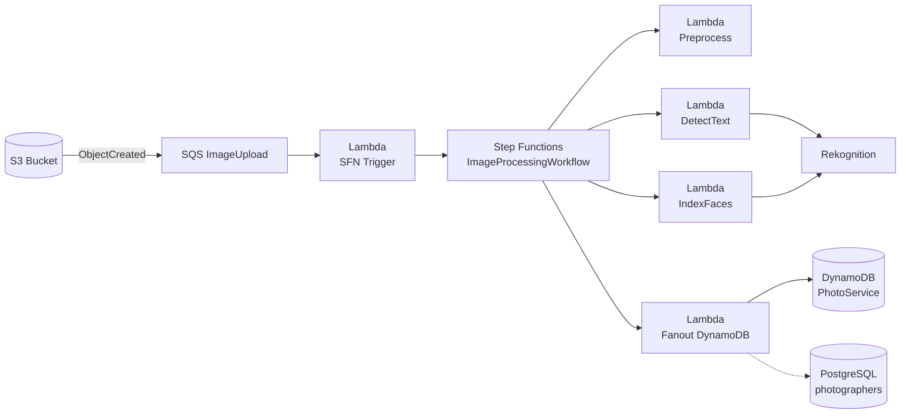

# LAMBDA_FUNCTIONS.md

# SnapRace Lambda Functions

본 문서는 SnapRace 이미지 파이프라인에서 사용하는 Lambda 함수들을 정의합니다.
각 함수의 책임, 입력/출력, 의존성, IAM 권한, 에러 처리 전략을 포함합니다.

Lambda 함수들은 **S3 → SQS → Step Functions → DynamoDB** 전체 흐름에서 특정 역할을 담당하며,
특히 다음 기능을 중심으로 설계되었습니다.

- 이미지 전처리 (리사이즈/압축)
- Rekognition 기반 텍스트(BIB) 및 얼굴 분석
- Photographer 메타데이터 처리 (S3 metadata + RDB 조회)
- DynamoDB 단일 테이블( PHOTO / BIB_INDEX ) 인덱싱

---

## 1. 전체 구조 요약



---

## 2. 공통 사항

### 2.1 런타임 & 언어

- Runtime: **Node.js 20.x**
- 언어: TypeScript (NodejsFunction 사용 가능) 또는 순수 JS (Function)
- 로깅: `console.log` + CloudWatch Logs

### 2.2 공통 환경변수 패턴

```env
STAGE=dev|prod
IMAGE_BUCKET=snaprace-images-{stage}
DDB_TABLE=PhotoService-{stage}
REGION=ap-northeast-2
RDS_CONNECTION_STRING=...
SUPABASE_SERVICE_ROLE_KEY=...
```

각 Lambda별로 필요한 값만 사용합니다.

---

## 3. SFN Trigger Lambda (`SfnTriggerFunction`)

### 3.1 역할

- SQS `ImageUpload` 큐를 소비
- 메시지(batch)를 처리하여 Step Functions `ImageProcessingWorkflow` 실행 시작
- S3 Object key에서 `orgId`, `eventId`를 파싱
- S3 HeadObject로 `photographer-id` 메타데이터를 읽어 workflow input에 포함

### 3.2 트리거

- Event Source: SQS `ImageUpload` 큐
- Batch size: 1~10 (조정 가능)

### 3.3 핸들러 시그니처 (예시)

```ts
import { SQSEvent } from 'aws-lambda';
import { SFNClient, StartExecutionCommand } from '@aws-sdk/client-sfn';
import { S3Client, HeadObjectCommand } from '@aws-sdk/client-s3';

const sfn = new SFNClient({});
const s3 = new S3Client({});

const STATE_MACHINE_ARN = process.env.STATE_MACHINE_ARN!;
const BUCKET_NAME = process.env.IMAGE_BUCKET!;

export const handler = async (event: SQSEvent) => {
  for (const record of event.Records) {
    const body = JSON.parse(record.body);
    const s3Record = body.Records?.[0]?.s3;
    if (!s3Record) continue;

    const bucket = s3Record.bucket.name;
    const key = decodeURIComponent(s3Record.object.key.replace(/\+/g, ' '));

    // key 예시: snaprace-kr/seoul-marathon-2024/raw/DSC_1234.jpg
    const [orgId, eventId, folder, ...rest] = key.split('/');

    // photographer-id 메타데이터 조회
    const head = await s3.send(
      new HeadObjectCommand({ Bucket: bucket, Key: key })
    );

    const photographerId = head.Metadata?.['photographer-id'];

    const input = {
      orgId,
      eventId,
      bucketName: bucket,
      rawKey: key,
      photographerId: photographerId ?? null,
    };

    await sfn.send(
      new StartExecutionCommand({
        stateMachineArn: STATE_MACHINE_ARN,
        input: JSON.stringify(input),
      }),
    );
  }
};
```

### 3.4 IAM 권한

- `sqs:ReceiveMessage`, `sqs:DeleteMessage`, `sqs:GetQueueAttributes`
- `states:StartExecution` (해당 State Machine)
- `s3:HeadObject` (IMAGE_BUCKET)
- CloudWatch Logs (`logs:*`)

---

## 4. Preprocess Lambda (`PreprocessFunction`)

### 4.1 역할

- S3 raw 이미지를 다운로드
- Sharp를 사용하여 리사이즈/압축
- ULID 생성 후 `processed/{ulid}.jpg`로 업로드
- 결과로 processed 이미지의 메타데이터를 반환

### 4.2 입력 (Step Functions에서 전달)

```jsonc
{
  "orgId": "snaprace-kr",
  "eventId": "seoul-marathon-2024",
  "bucketName": "snaprace-images-dev",
  "rawKey": "snaprace-kr/seoul-marathon-2024/raw/DSC_1234.jpg",
  "photographerId": "ph_01ABCXYZ" // 없을 수 있음
}
```

### 4.3 출력 (Step Functions로 반환)

```jsonc
{
  "orgId": "snaprace-kr",
  "eventId": "seoul-marathon-2024",
  "bucketName": "snaprace-images-dev",
  "rawKey": "...",
  "processedKey": "snaprace-kr/seoul-marathon-2024/processed/01HXY...jpg",
  "s3Uri": "s3://snaprace-images-dev/snaprace-kr/seoul-marathon-2024/processed/01HXY...jpg",
  "dimensions": { "width": 3840, "height": 2160 },
  "format": "jpeg",
  "size": 2048576,
  "ulid": "01HXY8FWZM5KJQD9K3Y6R8NZTP",
  "photographerId": "ph_01ABCXYZ"
}
```

### 4.4 구현 스케치

```ts
import { S3Client, GetObjectCommand, PutObjectCommand } from '@aws-sdk/client-s3';
import sharp from 'sharp';
import { ulid } from 'ulid';

const s3 = new S3Client({});
const BUCKET_NAME = process.env.IMAGE_BUCKET!;

export const handler = async (event: any) => {
  const { orgId, eventId, rawKey, photographerId } = event;

  const getRes = await s3.send(new GetObjectCommand({
    Bucket: BUCKET_NAME,
    Key: rawKey,
  }));

  const body = await getRes.Body?.transformToByteArray();
  if (!body) throw new Error('Empty S3 body');

  const id = ulid();
  const processedKey = `${orgId}/${eventId}/processed/${id}.jpg`;

  const image = sharp(body).rotate();
  const metadata = await image.metadata();

  const resized = await image
    .resize({ width: 4096, withoutEnlargement: true })
    .jpeg({ quality: 90 })
    .toBuffer();

  await s3.send(
    new PutObjectCommand({
      Bucket: BUCKET_NAME,
      Key: processedKey,
      Body: resized,
      ContentType: 'image/jpeg',
    }),
  );

  return {
    ...event,
    processedKey,
    s3Uri: `s3://${BUCKET_NAME}/${processedKey}`,
    dimensions: {
      width: metadata.width ?? null,
      height: metadata.height ?? null,
    },
    format: metadata.format ?? 'jpeg',
    size: resized.length,
    ulid: id,
    photographerId: photographerId ?? null,
  };
};
```

### 4.5 IAM 권한

- `s3:GetObject`, `s3:PutObject` (IMAGE_BUCKET)
- CloudWatch Logs

---

## 5. DetectText Lambda (`DetectTextFunction`)

### 5.1 역할

- Rekognition DetectText API를 호출해 이미지 내 텍스트를 분석
- bib 후보 문자열을 추출하여 반환

### 5.2 입력

Preprocess 단계 출력의 일부를 사용:

```jsonc
{
  "bucketName": "snaprace-images-dev",
  "processedKey": "snaprace-kr/seoul-marathon-2024/processed/01HXY...jpg",
  "orgId": "snaprace-kr",
  "eventId": "seoul-marathon-2024",
  "ulid": "01HXY..."
}
```

### 5.3 출력

```jsonc
{
  "bibs": ["1234", "5678"],
  "rawText": ["1234", "5678", "ADIDAS", "2024"],
  "confidence": 0.9
}
```

### 5.4 구현 스케치

```ts
import { RekognitionClient, DetectTextCommand } from '@aws-sdk/client-rekognition';

const rek = new RekognitionClient({});
const BUCKET_NAME = process.env.IMAGE_BUCKET!;

export const handler = async (event: any) => {
  const { processedKey } = event;

  const res = await rek.send(
    new DetectTextCommand({
      Image: {
        S3Object: {
          Bucket: BUCKET_NAME,
          Name: processedKey,
        },
      },
    }),
  );

  const bibCandidates: string[] = [];

  for (const t of res.TextDetections ?? []) {
    if (t.Type === 'WORD' && t.DetectedText) {
      // 간단 예시: 숫자 3~6자리를 bib 후보로 사용
      if (/^\d{3,6}$/.test(t.DetectedText)) {
        bibCandidates.push(t.DetectedText);
      }
    }
  }

  const unique = Array.from(new Set(bibCandidates));

  return {
    bibs: unique,
    rawText: (res.TextDetections ?? [])
      .map((t) => t.DetectedText)
      .filter(Boolean),
    confidence: 0.9,
  };
};
```

### 5.5 IAM 권한

- `rekognition:DetectText`
- `s3:GetObject` (processed 이미지)

---

## 6. IndexFaces Lambda (`IndexFacesFunction`)

### 6.1 역할

- Rekognition IndexFaces API를 호출해 얼굴을 컬렉션에 저장
- 컬렉션 ID는 `{orgId}-{eventId}` 형식으로 관리
- ExternalImageId에 S3 URI 또는 `PHOTO#{ulid}` 등을 저장 (추후 역추적용)

### 6.2 입력

```jsonc
{
  "orgId": "snaprace-kr",
  "eventId": "seoul-marathon-2024",
  "bucketName": "snaprace-images-dev",
  "processedKey": "snaprace-kr/seoul-marathon-2024/processed/01HXY...jpg",
  "ulid": "01HXY...",
  "s3Uri": "s3://..."
}
```

### 6.3 출력

```jsonc
{
  "faceIds": ["face-id-1", "face-id-2"],
  "faceCount": 2
}
```

### 6.4 구현 스케치

```ts
import {
  RekognitionClient,
  DescribeCollectionCommand,
  CreateCollectionCommand,
  IndexFacesCommand,
} from '@aws-sdk/client-rekognition';

const rek = new RekognitionClient({});
const BUCKET_NAME = process.env.IMAGE_BUCKET!;

const existingCollections = new Set<string>();

async function ensureCollectionExists(collectionId: string) {
  if (existingCollections.has(collectionId)) return;

  try {
    await rek.send(
      new DescribeCollectionCommand({ CollectionId: collectionId })
    );
    existingCollections.add(collectionId);
  } catch (err: any) {
    if (err.name === 'ResourceNotFoundException') {
      await rek.send(
        new CreateCollectionCommand({ CollectionId: collectionId })
      );
      existingCollections.add(collectionId);
    } else {
      throw err;
    }
  }
}

export const handler = async (event: any) => {
  const { orgId, eventId, processedKey, s3Uri } = event;
  const collectionId = `${orgId}-${eventId}`;

  await ensureCollectionExists(collectionId);

  const res = await rek.send(
    new IndexFacesCommand({
      CollectionId: collectionId,
      Image: {
        S3Object: {
          Bucket: BUCKET_NAME,
          Name: processedKey,
        },
      },
      ExternalImageId: s3Uri,
      MaxFaces: 15,
      QualityFilter: 'AUTO',
    }),
  );

  const faceIds = (res.FaceRecords ?? [])
    .map((r) => r.Face?.FaceId)
    .filter(Boolean) as string[];

  return {
    faceIds,
    faceCount: faceIds.length,
  };
};
```

### 6.5 IAM 권한

- `rekognition:CreateCollection`
- `rekognition:DescribeCollection`
- `rekognition:IndexFaces`
- `s3:GetObject`

---

## 7. Fanout DynamoDB Lambda (`FanoutDynamoDBFunction`)

### 7.1 역할

- Preprocess, DetectText, IndexFaces 결과를 종합
- DynamoDB `PHOTO` 및 `BIB_INDEX` 아이템을 생성
- PhotographerId가 있는 경우 **RDB에서 photographer 프로필 조회 후 denormalize**

### 7.2 입력 (Step Functions Parallel + 이전 상태 결과)

Step Functions에서 Fanout에 전달되는 입력 예시:

```jsonc
{
  "orgId": "snaprace-kr",
  "eventId": "seoul-marathon-2024",
  "bucketName": "snaprace-images-dev",
  "rawKey": "...",
  "processedKey": "...",
  "s3Uri": "s3://...",
  "dimensions": { "width": 3840, "height": 2160 },
  "format": "jpeg",
  "size": 2048576,
  "ulid": "01HXY...",
  "photographerId": "ph_01ABCXYZ",

  "detectTextResult": {
    "bibs": ["1234", "5678"],
    "rawText": ["1234", "5678", "ADIDAS"],
    "confidence": 0.9
  },

  "indexFacesResult": {
    "faceIds": ["face-1", "face-2"],
    "faceCount": 2
  }
}
```

### 7.3 처리 로직 개요

1. RDB에서 photographer 정보 조회 (photographerId가 있는 경우)
   - `SELECT instagram_handle, display_name FROM photographers WHERE photographer_id = $1`
2. DynamoDB PHOTO 아이템 생성
3. bib 배열에 대해 BIB_INDEX 아이템 생성

### 7.4 구현 스케치 (핵심 로직)

```ts
import { DynamoDBClient } from '@aws-sdk/client-dynamodb';
import { DynamoDBDocumentClient, PutCommand } from '@aws-sdk/lib-dynamodb';

const ddb = DynamoDBDocumentClient.from(new DynamoDBClient({}));
const TABLE_NAME = process.env.DDB_TABLE!;

// 여기는 예시: Supabase / RDS 클라이언트 (구현체에 따라 교체)
async function fetchPhotographerProfile(photographerId: string) {
  if (!photographerId) return null;
  // TODO: 실제 RDB 호출 코드로 교체
  return null;
}

export const handler = async (event: any) => {
  const {
    orgId,
    eventId,
    bucketName,
    rawKey,
    processedKey,
    s3Uri,
    dimensions,
    format,
    size,
    ulid,
    photographerId,
    detectTextResult,
    indexFacesResult,
  } = event;

  const bibs: string[] = detectTextResult?.bibs ?? [];
  const faceIds: string[] = indexFacesResult?.faceIds ?? [];

  let photographerHandle: string | null = null;
  let photographerDisplayName: string | null = null;

  if (photographerId) {
    const profile = await fetchPhotographerProfile(photographerId);
    if (profile) {
      photographerHandle = profile.instagram_handle ?? null;
      photographerDisplayName = profile.display_name ?? null;
    }
  }

  const now = new Date().toISOString();

  const pk = `ORG#${orgId}#EVT#${eventId}`;
  const sk = `PHOTO#${ulid}`;

  // PHOTO 아이템 작성
  const photoItem: any = {
    PK: pk,
    SK: sk,
    EntityType: 'PHOTO',

    ulid,
    orgId,
    eventId,
    originalFilename: rawKey.split('/').slice(-1)[0],
    rawKey,
    processedKey,
    s3Uri,

    dimensions,
    format,
    size,

    bibs,
    bibCount: bibs.length,
    faceIds,
    faceCount: faceIds.length,

    createdAt: now,
    updatedAt: now,
  };

  // Photographer 정보 denormalize + GSI2 키 설정
  if (photographerId) {
    photoItem.photographerId = photographerId;
    if (photographerHandle) photoItem.photographerHandle = photographerHandle;
    if (photographerDisplayName) photoItem.photographerDisplayName = photographerDisplayName;

    photoItem.GSI2PK = `PHOTOGRAPHER#${photographerId}`;
    photoItem.GSI2SK = `EVT#${eventId}#TIME#${now}`;
  }

  const puts: PutCommand[] = [];

  // PHOTO Put
  puts.push(
    new PutCommand({
      TableName: TABLE_NAME,
      Item: photoItem,
    }) as any,
  );

  // BIB_INDEX Put (bibs마다 1개씩)
  for (const bib of bibs) {
    const bibItem = {
      PK: pk,
      SK: `BIB#${bib}#PHOTO#${ulid}`,
      EntityType: 'BIB_INDEX',
      GSI1PK: `EVT#${eventId}#BIB#${bib}`,
      GSI1SK: `PHOTO#${ulid}`,
      ulid,
      orgId,
      eventId,
      bib,
      createdAt: now,
    };

    puts.push(
      new PutCommand({
        TableName: TABLE_NAME,
        Item: bibItem,
      }) as any,
    );
  }

  // 순차 실행 (규모에 따라 BatchWrite로 변경 가능)
  for (const cmd of puts) {
    await ddb.send(cmd);
  }

  return { ok: true };
};
```

### 7.5 IAM 권한

- `dynamodb:PutItem` (PhotoService 테이블)
- (옵션) RDS/Supabase 접근 권한 (photographers 조회)
- CloudWatch Logs

---

## 8. 에러 처리 및 재시도 전략

- SQS → SFN Trigger
  - Lambda 레벨에서 실패 시 메시지는 visibility timeout 후 재시도
  - 일정 횟수 이상 실패 시 DLQ로 이동

- Step Functions
  - 각 Task(State)별 Retry/Catch 정의 (`STEP_FUNCTIONS_WORKFLOW.md` 참고)
  - Preprocess / DetectText / IndexFaces / Fanout 각각 재시도 정책 설정

- Fanout DynamoDB
  - DynamoDB 쓰기 실패 시 재시도 후 Fail state로 전파

---

## 9. 정리

이 문서는 SnapRace 이미지 파이프라인에서 사용되는 Lambda 함수들의

- 책임
- 입력/출력
- 의존 서비스(S3, Rekognition, DynamoDB, RDB)
- IAM 최소 권한

을 정의합니다.

Photographer 관련 로직(S3 metadata → RDB 프로필 조회 → Dynamo PHOTO denormalize)은
`FanoutDynamoDBFunction`에 집중되어 있으며,
이 구조를 통해 **갤러리 조회 시 DynamoDB만 읽어도 충분한 정보를 제공**할 수 있습니다.