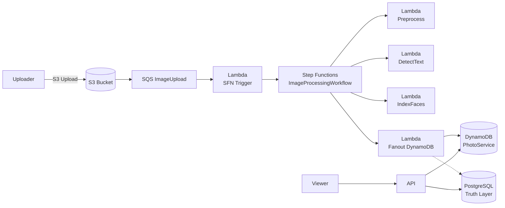

# README.md

# SnapRace Photo Platform

SnapRace는 러닝/레이스 이벤트의 **사진 업로드 → 자동 분석 → 갤러리 제공 → bib/selfie/photographer 검색**까지 전 과정을 자동화하는 플랫폼입니다.

이 문서는 SnapRace 백엔드 시스템 전체 구조를 한눈에 파악할 수 있도록 설계 개요를 제공합니다.

---

# 📌 주요 기능

## 🏞️ 사진 업로드 & 자동 처리
- Photographer 또는 Organizer가 S3로 사진 업로드
- 이미지 업로드 시 S3 메타데이터로 photographer-id 전달 가능
- 업로드 후 자동으로 이미지 처리 파이프라인 실행 (전처리 + 분석)

## 🔍 사진 분석 (BIB / Face)
- AWS Rekognition DetectText → bib 자동 인식
- AWS Rekognition IndexFaces → 얼굴 기반 검색 지원
- 여러 BIB 검출, 여러 얼굴 검출 모두 지원

## ⚡ 고성능 이미지 검색
- **BIB 검색**  
- **Photographer별 갤러리**  
- **이벤트 전체 사진 조회**  
- **Selfie(얼굴) 검색**  

DynamoDB 단일 테이블 + GSI1/GSI2 구조로 모든 조회는 **Query 1번**으로 해결.

## 🏁 이벤트 & 러너 정보 관리 (RDB)
- organizers / events / event_runners 관리
- 사진-only 이벤트(`PHOTOS_ONLY`) 또는 결과+사진(`RESULTS_AND_PHOTOS`) 모두 지원
- photographer 프로필 및 event_photographers 매핑 관리

## 📤 이미지 서빙
- CloudFront CDN으로 전처리된 이미지 서빙
- `processed/` 이미지는 항상 웹 최적화된 상태

---

# 🏗️ 전체 아키텍처

전체 아키텍처는 **RDB Truth Layer + DynamoDB Read Layer + Step Functions 파이프라인** 조합으로 구성됩니다.



---

# 🔧 구성 요소

## 1) RDB (PostgreSQL / Supabase)
Truth Layer
- organizers
- events (`display_mode`, `results_integration`, `photos_meta` 포함)
- event_runners
- photographers
- event_photographers (N:N)

📄 세부 문서 → `RDB_SCHEMA.md`

---

## 2) DynamoDB (PhotoService)
Read-Optimized Layer
- PHOTO (사진 1장당 1개)
- BIB_INDEX (bib별 인덱스)
- **GSI1** – BIB 검색
- **GSI2** – Photographer 검색

📄 세부 문서 → `DYNAMODB_SCHEMA.md`

---

## 3) Lambda Functions
- `SfnTriggerFunction`: S3 Event → SFN 시작 + photographerId 읽기
- `PreprocessFunction`: 이미지 최적화 + processed 저장
- `DetectTextFunction`: Rekognition DetectText
- `IndexFacesFunction`: Rekognition IndexFaces + 컬렉션 생성
- `FanoutDynamoDBFunction`: PHOTO + BIB_INDEX 생성, photographer denormalize

📄 세부 문서 → `LAMBDA_FUNCTIONS.md`

---

## 4) Step Functions Workflow
병렬 Rekognition 분석 + 최종 DynamoDB 저장

📄 세부 문서 → `STEP_FUNCTIONS_WORKFLOW.md`

---

## 5) 이미지 서빙
- CDN: CloudFront
- S3 processed 경로에서 서빙
- path 예시:
```
https://images.snap-race.com/{organizer}/{event}/processed/{ulid}.jpg
```

---

# 📦 디렉토리 구조 (예시)

```
/infra
  /cdk
  /lambda

/backend
  /api
  /supabase
  /rekognition

/docs
  - README.md
  - ARCHITECTURE.md
  - RDB_SCHEMA.md
  - DYNAMODB_SCHEMA.md
  - LAMBDA_FUNCTIONS.md
  - STEP_FUNCTIONS_WORKFLOW.md
  - DEPLOYMENT.md
  - INDEX.md
```

---

# 🚀 개발 플로우

1. S3 presigned URL을 생성해 업로더에게 제공
2. 사진 업로드 시 `x-amz-meta-photographer-id` 포함 가능
3. 파이프라인 자동 실행 → DynamoDB 저장
4. 프론트엔드는 API 통해 사진 목록 조회

---

# 🪪 권한 및 보안
- S3 업로드는 presigned URL 기반
- Lambda 최소 권한 원칙 적용
- SQS DLQ 구성
- DynamoDB PITR(Point-in-Time Recovery) 활성화
- Step Functions X-Ray tracing 활성화

---

# 🧪 로컬 테스트 전략
- Lambda 개별 테스트 (localstack 또는 mock)
- Step Functions ASL mock tester
- DynamoDB write/read 테스트
- S3 metadata 자동 파싱 테스트

---

# 📈 모니터링
- CloudWatch Alarms: DLQ, SFN Fail, Lambda ErrorRate
- SQS Queue Depth monitoring
- DynamoDB Throttle 체크

---

# 📚 참고 문서
- ARCHITECTURE.md – 전체 아키텍처
- RDB_SCHEMA.md – Truth Layer 스키마
- DYNAMODB_SCHEMA.md – DynamoDB 설계
- LAMBDA_FUNCTIONS.md – Lambda 함수 정의
- STEP_FUNCTIONS_WORKFLOW.md – Step Functions 워크플로
- DEPLOYMENT.md – 배포 가이드
- INDEX.md – 문서 인덱스

---

# 🎯 목표
SnapRace 플랫폼의 목표는

- **완전 자동화**된 이미지 처리 파이프라인
- **고성능 검색** (bib/selfie/photographer)
- **운영과 확장이 쉬운 구조**

을 제공하는 것입니다.

본 문서는 SnapRace 백엔드의 전체적인 개요를 제공하며,  
작업별 상세 문서는 docs 아래 각 md 파일을 참고하십시오.

