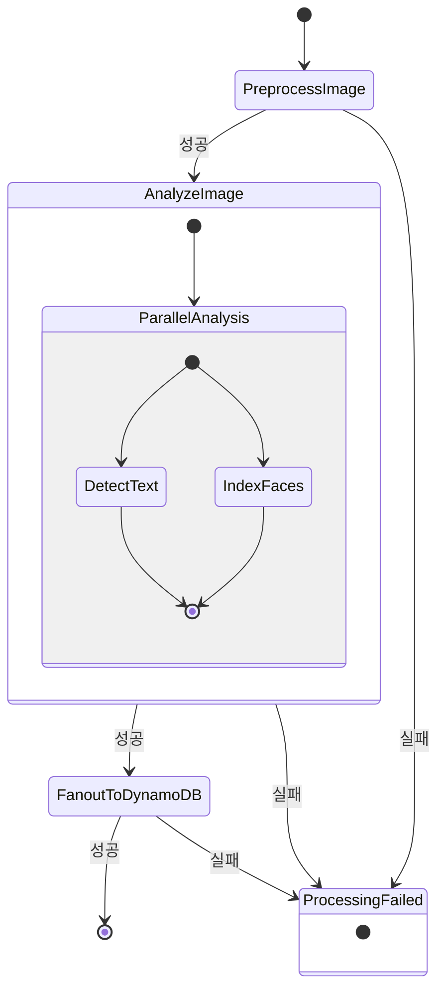

# STEP_FUNCTIONS_WORKFLOW.md

# Step Functions: ImageProcessingWorkflow

본 문서는 SnapRace 이미지 파이프라인의 핵심인
AWS Step Functions 상태 머신 **`ImageProcessingWorkflow`**의 동작을 정의합니다.

- 입력/출력 스키마
- 상태 다이어그램
- 각 State 역할
- Retry / Catch 전략
- Photographer 메타데이터 전달 흐름

---

## 1. 개요

`ImageProcessingWorkflow`는 S3에 이미지가 업로드된 이후,

1. 전처리 (리사이즈/압축)
2. Rekognition 텍스트(BIB) 분석
3. Rekognition 얼굴 인덱싱
4. DynamoDB 인덱싱 (PHOTO + BIB_INDEX)

까지의 전체 작업을 **내결함성 있게 오케스트레이션**합니다.

이 워크플로는 SQS → SFN Trigger Lambda에 의해 시작되며,
Photographer 정보(`photographerId`)도 입력으로 전달되어 DynamoDB까지 흐릅니다.

---

## 2. 상태 다이어그램



---

## 3. 입력 / 출력 스키마

### 3.1 워크플로 입력 (SfnTriggerFunction → State Machine)

SQS 메시지와 S3 메타데이터를 파싱한 후, SFN Trigger Lambda는 다음과 같은 input을 전달합니다.

```jsonc
{
  "orgId": "snaprace-kr",
  "eventId": "seoul-marathon-2024",
  "bucketName": "snaprace-images-dev",
  "rawKey": "snaprace-kr/seoul-marathon-2024/raw/DSC_1234.jpg",
  "photographerId": "ph_01ABCXYZ"  // 없을 수 있음
}
```

필수:
- `orgId`, `eventId`, `bucketName`, `rawKey`

옵션:
- `photographerId` (없으면 `null` 또는 필드 자체를 생략)

### 3.2 최종 출력 (FanoutToDynamoDB 결과)

Step Functions 입장에서는 **최종 State(FanoutToDynamoDB)**의 반환값이 전체 워크플로 결과입니다.

```jsonc
{
  "ok": true
}
```

실제 데이터는 DynamoDB에 저장되며, 워크플로 출력에서는 최소한의 상태만 리턴합니다.

---

## 4. ASL 정의 (요약 버전)

아래는 Amazon States Language로 표현한 상태 머신 정의의 요약 버전입니다.

```jsonc
{
  "Comment": "Image Processing Workflow for BIB detection, face indexing and DynamoDB fanout",
  "StartAt": "PreprocessImage",
  "States": {
    "PreprocessImage": {
      "Type": "Task",
      "Resource": "arn:aws:lambda:REGION:ACCOUNT:function:PreprocessFunction",
      "TimeoutSeconds": 300,
      "Retry": [
        {
          "ErrorEquals": ["States.TaskFailed"],
          "IntervalSeconds": 2,
          "MaxAttempts": 3,
          "BackoffRate": 2.0
        }
      ],
      "Catch": [
        {
          "ErrorEquals": ["States.ALL"],
          "Next": "ProcessingFailed"
        }
      ],
      "ResultPath": "$",
      "Next": "AnalyzeImage"
    },

    "AnalyzeImage": {
      "Type": "Parallel",
      "Branches": [
        {
          "StartAt": "DetectText",
          "States": {
            "DetectText": {
              "Type": "Task",
              "Resource": "arn:aws:lambda:REGION:ACCOUNT:function:DetectTextFunction",
              "TimeoutSeconds": 30,
              "Retry": [
                {
                  "ErrorEquals": ["States.TaskFailed"],
                  "IntervalSeconds": 1,
                  "MaxAttempts": 2,
                  "BackoffRate": 2.0
                }
              ],
              "Catch": [
                {
                  "ErrorEquals": ["States.ALL"],
                  "ResultPath": "$.detectTextError",
                  "Next": "DetectTextFallback"
                }
              ],
              "ResultPath": "$.detectTextResult",
              "End": true
            },
            "DetectTextFallback": {
              "Type": "Pass",
              "Result": {
                "bibs": [],
                "rawText": [],
                "confidence": 0
              },
              "ResultPath": "$.detectTextResult",
              "End": true
            }
          }
        },
        {
          "StartAt": "IndexFaces",
          "States": {
            "IndexFaces": {
              "Type": "Task",
              "Resource": "arn:aws:lambda:REGION:ACCOUNT:function:IndexFacesFunction",
              "TimeoutSeconds": 30,
              "Retry": [
                {
                  "ErrorEquals": ["States.TaskFailed"],
                  "IntervalSeconds": 1,
                  "MaxAttempts": 2,
                  "BackoffRate": 2.0
                }
              ],
              "Catch": [
                {
                  "ErrorEquals": ["States.ALL"],
                  "ResultPath": "$.indexFacesError",
                  "Next": "IndexFacesFallback"
                }
              ],
              "ResultPath": "$.indexFacesResult",
              "End": true
            },
            "IndexFacesFallback": {
              "Type": "Pass",
              "Result": {
                "faceIds": [],
                "faceCount": 0
              },
              "ResultPath": "$.indexFacesResult",
              "End": true
            }
          }
        }
      ],
      "ResultPath": "$",
      "Next": "FanoutToDynamoDB"
    },

    "FanoutToDynamoDB": {
      "Type": "Task",
      "Resource": "arn:aws:lambda:REGION:ACCOUNT:function:FanoutDynamoDBFunction",
      "TimeoutSeconds": 60,
      "Retry": [
        {
          "ErrorEquals": ["States.TaskFailed"],
          "IntervalSeconds": 2,
          "MaxAttempts": 3,
          "BackoffRate": 2.0
        }
      ],
      "Catch": [
        {
          "ErrorEquals": ["States.ALL"],
          "Next": "ProcessingFailed"
        }
      ],
      "ResultPath": "$",
      "End": true
    },

    "ProcessingFailed": {
      "Type": "Fail",
      "Error": "ImageProcessingError",
      "Cause": "Failed to process image"
    }
  }
}
```

> 위 JSON은 구조 설명용이며, 실제 ARN/리전/계정 ID는 CDK에서 주입합니다.

---

## 5. State별 상세 설명

### 5.1 PreprocessImage (Task)

**입력**: 워크플로 전체 입력 (orgId, eventId, bucketName, rawKey, photographerId)

**동작**:
- S3에서 raw 이미지를 다운로드
- Sharp로 리사이즈 및 JPEG 압축
- `processed/{ulid}.jpg`로 S3 업로드
- 이미지 메타데이터(가로/세로/포맷/사이즈) 계산
- `ulid` 및 `s3Uri` 생성

**출력**:

```jsonc
{
  "orgId": "...",
  "eventId": "...",
  "bucketName": "...",
  "rawKey": "...",
  "processedKey": "...",
  "s3Uri": "s3://...",
  "dimensions": { "width": 3840, "height": 2160 },
  "format": "jpeg",
  "size": 2048576,
  "ulid": "01HXY...",
  "photographerId": "ph_01ABCXYZ"  // 원본 input에서 그대로 유지
}
```

**Retry 전략**:
- 최대 3회 재시도 (2초 → 4초 → 8초 backoff)

**Catch**:
- 모든 에러(`States.ALL`)를 `ProcessingFailed`로 전파 (하드 에러로 처리)

---

### 5.2 AnalyzeImage (Parallel)

두 개의 브랜치를 병렬로 수행:

1. DetectText (텍스트/BIB 분석)
2. IndexFaces (얼굴 인덱싱)

각 브랜치는 내부에서 실패 시 Fallback Pass State로 graceful degrade 합니다.

#### 5.2.1 DetectText 브랜치

**입력**: Preprocess 출력 전체 (특히 `processedKey`, `bucketName`, `orgId`, `eventId`, `ulid`)

**출력** (성공 시):

```jsonc
{
  "detectTextResult": {
    "bibs": ["1234", "5678"],
    "rawText": ["1234", "5678", "ADIDAS"],
    "confidence": 0.9
  }
}
```

**실패 시 처리**:
- Catch에서 `DetectTextFallback`으로 이동
- `DetectTextFallback`은 빈 결과를 반환:

```jsonc
{
  "detectTextResult": {
    "bibs": [],
    "rawText": [],
    "confidence": 0
  }
}
```

→ 즉, DetectText가 실패해도 전체 워크플로는 계속 진행하되 **해당 사진에 bib는 없는 것**으로 처리.

#### 5.2.2 IndexFaces 브랜치

**입력**: Preprocess 출력 전체

**출력** (성공 시):

```jsonc
{
  "indexFacesResult": {
    "faceIds": ["face-1", "face-2"],
    "faceCount": 2
  }
}
```

**실패 시 처리**:
- Catch에서 `IndexFacesFallback`으로 이동
- `IndexFacesFallback`은 빈 얼굴 결과를 반환:

```jsonc
{
  "indexFacesResult": {
    "faceIds": [],
    "faceCount": 0
  }
}
```

→ 얼굴 인덱싱이 실패해도 워크플로는 진행되며, 해당 사진은 Selfie 검색에 사용되지 않을 뿐입니다.

---

### 5.3 FanoutToDynamoDB (Task)

**입력**: Preprocess 결과 + Parallel 두 브랜치 결과가 모두 병합된 형태.

예시:

```jsonc
{
  "orgId": "...",
  "eventId": "...",
  "bucketName": "...",
  "rawKey": "...",
  "processedKey": "...",
  "s3Uri": "s3://...",
  "dimensions": { "width": 3840, "height": 2160 },
  "format": "jpeg",
  "size": 2048576,
  "ulid": "01HXY...",
  "photographerId": "ph_01ABCXYZ",

  "detectTextResult": {
    "bibs": ["1234", "5678"],
    "rawText": ["1234", "5678"],
    "confidence": 0.9
  },

  "indexFacesResult": {
    "faceIds": ["face-1"],
    "faceCount": 1
  }
}
```

**동작**:
- `detectTextResult.bibs`를 사용하여 BIB_INDEX 레코드 생성
- `indexFacesResult.faceIds`를 PHOTO에 저장
- `photographerId`가 있으면 RDB `photographers`에서 프로필 조회 후 denormalize
- DynamoDB에 PHOTO + BIB_INDEX 저장

**출력**:

```jsonc
{
  "ok": true
}
```

**Retry 전략**:
- 최대 3회 재시도 (2초 → 4초 → 8초 backoff)

**Catch**:
- 모든 에러는 `ProcessingFailed`로 이동 (데이터 정합성을 위해 hard fail 처리)

---

### 5.4 ProcessingFailed (Fail)

- 워크플로 전체를 실패로 종료
- CloudWatch + Step Functions에서 알람 조건에 사용
- 실패한 이미지에 대해서는 DLQ나 별도 재처리 파이프라인을 통해 후속 조치 가능

---

## 6. CDK 구성 예시

```ts
import * as sfn from 'aws-cdk-lib/aws-stepfunctions';
import * as tasks from 'aws-cdk-lib/aws-stepfunctions-tasks';

// Lambda Task 정의
const preprocessTask = new tasks.LambdaInvoke(this, 'PreprocessImage', {
  lambdaFunction: preprocessFn,
  outputPath: '$',
});

const detectTextTask = new tasks.LambdaInvoke(this, 'DetectText', {
  lambdaFunction: detectTextFn,
  outputPath: '$.Payload',
});

const indexFacesTask = new tasks.LambdaInvoke(this, 'IndexFaces', {
  lambdaFunction: indexFacesFn,
  outputPath: '$.Payload',
});

const fanoutTask = new tasks.LambdaInvoke(this, 'FanoutToDynamoDB', {
  lambdaFunction: fanoutFn,
  outputPath: '$.Payload',
});

// Parallel state 구성
const parallelAnalysis = new sfn.Parallel(this, 'AnalyzeImage');

parallelAnalysis
  .branch(detectTextTask)
  .branch(indexFacesTask);

// 전체 State Machine 정의
const stateMachine = new sfn.StateMachine(this, 'ImageProcessingWorkflow', {
  stateMachineName: `image-processing-${stage}`,
  definition: preprocessTask.next(parallelAnalysis).next(fanoutTask),
  timeout: cdk.Duration.minutes(15),
  tracingEnabled: true,
  logs: {
    destination: logGroup,
    level: sfn.LogLevel.ALL,
  },
});
```

실제 Retry/Catch는 `addRetry`, `addCatch` 또는 ASL level에서 설정할 수 있습니다.

---

## 7. Photographer 메타데이터 흐름 요약

1. S3 업로드 시 `x-amz-meta-photographer-id`를 넣음
2. SfnTrigger Lambda에서 S3 HeadObject로 photographerId를 읽음
3. State Machine input에 `photographerId`로 포함
4. Preprocess → AnalyzeImage → FanoutToDynamoDB까지 **그대로 전달**
5. FanoutToDynamoDB에서 해당 값을 사용하여 RDB `photographers` 조회 및 PHOTO에 denormalize

이 흐름을 통해, Photographer 정보는 **업로드 시점부터 DynamoDB까지 end-to-end로 이어지며**,  
갤러리/검색 API는 DynamoDB만 조회해도 Photographer 정보(핸들, 표시 이름 등)를 바로 사용할 수 있습니다.

---

## 8. 요약

- `ImageProcessingWorkflow`는 이미지 업로드 후 분석/인덱싱까지의 전체 프로세스를 담당
- Preprocess → Parallel(DetectText & IndexFaces) → FanoutToDynamoDB 구조
- 실패 시에는 graceful degrade (텍스트/얼굴 분석) 또는 hard fail (전처리/팬아웃)
- PhotographerId는 입력부터 출력까지 유지되며, 최종적으로 DynamoDB PHOTO에 반영됨

이 문서는 CDK, Lambda, DynamoDB, RDB 설계 문서와 함께 사용하여  
SnapRace 이미지 파이프라인을 구현/운영하는 기준이 됩니다.

