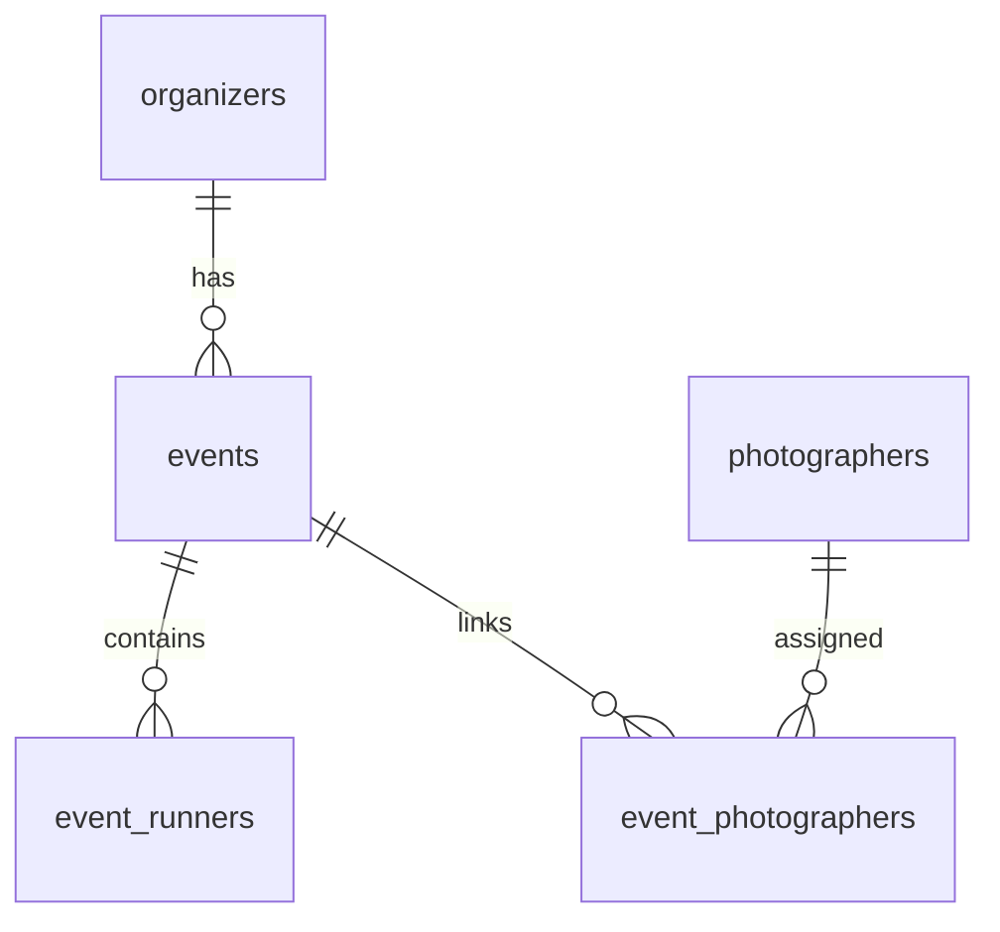

# RDB_SCHEMA.md

# SnapRace RDB Schema Documentation

본 문서는 SnapRace 플랫폼의 **관계형 데이터베이스(PostgreSQL/Supabase)** 스키마 전체를 정의한 공식 문서입니다.

이 문서는 다음 구조로 구성됩니다:
- 전체 개요
- ERD(Entity Relationship Diagram)
- 테이블 정의
  - organizers
  - events
  - event_runners
  - photographers
  - event_photographers
- 쿼리 패턴
- 데이터 흐름 (RDB ↔ SnapRace 시스템)
- 변경 이력

---

# 📌 1. 개요

SnapRace의 RDB는 다음 역할을 담당합니다:

### **1) 이벤트 메타데이터 관리**
- Organizer 정보
- Event 정보 (사진-only / 결과 + 사진 지원)
- Runner 정보 (공식 기록 있는 이벤트만)

### **2) Photographer 관리 및 이벤트 연결**
- 사진-only 이벤트(예: NYCM)에서 각 사진의 저작자를 명확히 표시
- 이벤트 단위로 여러 Photographer 연결 (N:N 관계)

### **3) DynamoDB와의 역할 분리**
- RDB = Truth (조직/이벤트/포토그래퍼/런너 관리)
- DynamoDB = Fast Query (갤러리/검색/포토그래퍼별 사진 조회)

---

# 📌 2. ERD



---

# 📌 3. 테이블 정의

각 테이블은 SnapRace 프론트엔드/백엔드가 의존하는 핵심 엔티티이며, Supabase(PostgreSQL)에서 관리됩니다.

---

## 🏛️ 3.1. organizers

대회 주최사(Organizer) 정보 저장

```sql
CREATE TABLE public.organizers (
  organizer_id text PRIMARY KEY,
  name text NOT NULL,
  subdomain text NOT NULL UNIQUE,
  active boolean DEFAULT true,
  branding_meta jsonb NULL,
  created_at timestamptz NOT NULL DEFAULT (now() AT TIME ZONE 'utc')
);
```

### 📌 목적
- 조직별 커스텀 도메인/브랜딩 지원
- 이벤트 목록 화면에서 organizer 필터 가능

---

## 🏁 3.2. events

각 Organizer가 가진 개별 대회/이벤트 정보 저장

```sql
CREATE TABLE public.events (
  event_id text PRIMARY KEY,
  organizer_id text NOT NULL,
  name text NOT NULL,
  event_date timestamptz NOT NULL,
  location text NULL,
  thumbnail_image text NULL,
  participant_count integer NULL,
  event_type text NULL,

  -- 신규 추가 항목
  display_mode text NOT NULL DEFAULT 'RESULTS_AND_PHOTOS',
  results_integration jsonb NULL,
  photos_meta jsonb NULL,

  CONSTRAINT events_organizer_id_fkey
    FOREIGN KEY (organizer_id) REFERENCES public.organizers (organizer_id)
    ON DELETE CASCADE
);
```

### 📌 주요 개념
#### `display_mode`
- `RESULTS_AND_PHOTOS` → 기존 like "Millennium Running"
- `PHOTOS_ONLY` → 사진-only 대회 (NYCM 등)

#### `results_integration`
외부 타이밍 회사 연동 정보 저장

예시:
```json
{
  "provider": "raceresult",
  "event_code": "230129",
  "imported_at": "2025-01-02T00:00:00Z"
}
```

#### `photos_meta`
이벤트별 사진 옵션 저장
```json
{
  "default_sort": "createdAt",
  "view_type": "grid"
}
```

---

## 🏃 3.3. event_runners

이벤트 참가자 및 결과 저장. (결과가 없는 이벤트에서는 없어도 됨)

```sql
CREATE TABLE public.event_runners (
  event_id text NOT NULL,
  bib_number text NOT NULL,
  name text NULL,
  finish_time text NULL,
  gender text NULL,
  age integer NULL,
  team text NULL,
  timing_result jsonb NULL,
  source text NULL,

  PRIMARY KEY (event_id, bib_number),

  CONSTRAINT event_runners_event_id_fkey
    FOREIGN KEY (event_id) REFERENCES public.events (event_id)
    ON DELETE CASCADE
);
```

### 📌 비고
- `timing_result` 는 JSON(B)으로 여유 있게 정의 (레이스별 format 다름)
- `PHOTOS_ONLY` 이벤트에서는 데이터 0개여도 정상

---

# 📸 3.4. photographers

Photographer 프로필 저장.  
사진-only 이벤트에서 필수.

```sql
CREATE TABLE public.photographers (
  photographer_id text PRIMARY KEY,

  name text NOT NULL,             -- 내부 관리용 이름
  display_name text NULL,         -- UI 표시 이름 (브랜드/스튜디오명)
  instagram_handle text NULL UNIQUE,
  profile_image_url text NULL,
  website_url text NULL,
  email text NULL,
  social_links jsonb NULL,        -- { instagram, facebook, x, ... }
  bio text NULL,
  active boolean NOT NULL DEFAULT true,
  created_at timestamptz NOT NULL DEFAULT (now() AT TIME ZONE 'utc')
);
```

### 📌 Photographer 데이터는 RDB가 Truth
DynamoDB에는 PHOTO 아이템에 denormalize된 값이 들어감 (`photographerHandle`, `displayName`).

---

# 🔗 3.5. event_photographers (N:N 관계)

이벤트와 포토그래퍼를 연결

```sql
CREATE TABLE public.event_photographers (
  event_id text NOT NULL,
  photographer_id text NOT NULL,
  role text NULL,                 -- primary / secondary / drone / video
  sort_order integer NULL,
  note text NULL,
  created_at timestamptz NOT NULL DEFAULT (now() AT TIME ZONE 'utc'),

  PRIMARY KEY (event_id, photographer_id),

  CONSTRAINT event_photographers_event_id_fkey
    FOREIGN KEY (event_id) REFERENCES public.events (event_id)
    ON DELETE CASCADE,

  CONSTRAINT event_photographers_photographer_id_fkey
    FOREIGN KEY (photographer_id) REFERENCES public.photographers (photographer_id)
    ON DELETE CASCADE
);

CREATE INDEX event_photographers_photographer_id_idx
  ON public.event_photographers (photographer_id);
```

### 📌 목적
- 업로드 UI에서 Photographer 선택 가능
- S3 metadata의 photographer-id 검증
- 사진-only 이벤트에서 "Photos by @studio_aaa" 표시 가능

---

# 🎯 4. 주요 쿼리 패턴

### 📌 이벤트에 등록된 Photographer 조회
```sql
SELECT p.*
FROM event_photographers ep
JOIN photographers p ON ep.photographer_id = p.photographer_id
WHERE ep.event_id = 'ev_2025_nycm'
ORDER BY ep.sort_order NULLS LAST;
```

### 📌 한 Photographer가 촬영한 전체 이벤트 조회
```sql
SELECT e.*
FROM event_photographers ep
JOIN events e ON ep.event_id = e.event_id
WHERE ep.photographer_id = 'ph_aaa'
ORDER BY e.event_date DESC;
```

### 📌 Runner 조회
```sql
SELECT * FROM event_runners
WHERE event_id = 'ev_2025_boston' AND bib_number = '1234';
```

---

# 🔄 5. RDB ↔ DynamoDB 연동 (핵심 설계)

### ✔ S3 업로드
S3 metadata에 photographer_id 포함
```
x-amz-meta-photographer-id: ph_aaa
```

### ✔ Preprocess Lambda
S3 metadata → State Machine input으로 전달

### ✔ Fanout DynamoDB Lambda
- photographer_id 기반으로 RDB `photographers` 조회
- DynamoDB PHOTO에 다음 정보 저장:
```json
{
  "photographerId": "ph_aaa",
  "photographerHandle": "studio_aaa",
  "photographerDisplayName": "Studio AAA",
  "GSI2PK": "PHOTOGRAPHER#ph_aaa",
  "GSI2SK": "EVT#eventId#TIME#..."
}
```

### ✔ Photographer 프로필 수정 시
- admin이 photographer handle 변경 → RDB update
- worker가 GSI2로 Dynamo PHOTO 아이템 전체 찾아서 update

---

# 📝 6. 변경 이력

| 버전 | 내용 |
|------|------|
| 1.0 | organizers, events, event_runners 기본 스키마 작성 |
| 2.0 | photographers / event_photographers 추가 |
| 2.1 | events.display_mode / results_integration / photos_meta 추가 |
| 2.2 | Dynamo PHOTO의 photographer 연동 규칙 문서화 |

---

본 문서는 SnapRace 시스템의 **RDB Truth Layer**를 정의하며,  
DynamoDB 및 이미지 파이프라인 문서와 함께 사용됩니다.

